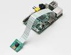
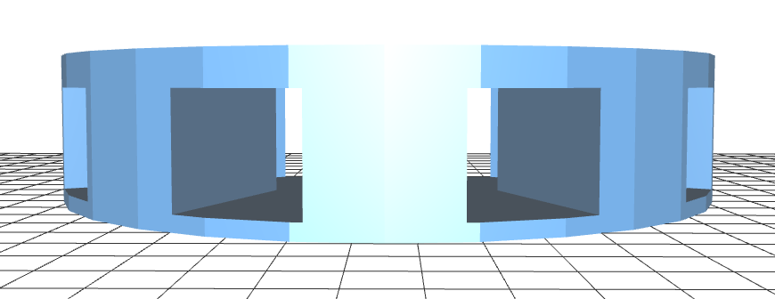
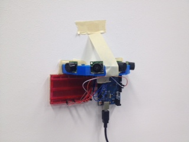
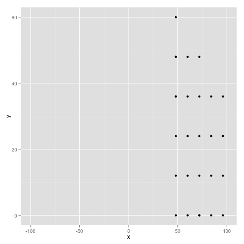
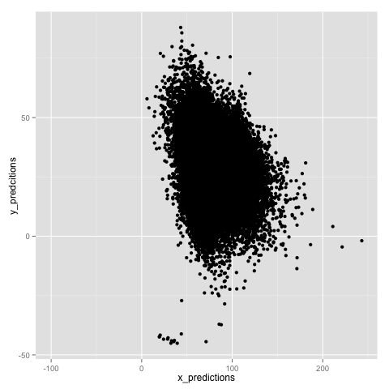

## Digital Fabrication Project: Tracking Movement

- A thought: 
 - We know how, to each mouse click, people use websites
 - Can we do the same for the real world? 
 
!

## Project Goal

- Ambitious Overarching Statement:
	- Create a way to measure how people interact with the built environment.
	
	
!

## Project Goal
	 
- Real-Life:
	- Get a plot of where movement is occuring in the HAL. 

!


## Idea 1: Cameras!
- 
- Problem: No Depth Perception
- Networking a group of camera to generate accurate X-Y values is not easy.

!

## Idea 2: Ultrasonic Sensors

- Sensors that report the distance to the nearest object many times a second.

!

## The Build

- Use the sensors to create a good coverage map
- Each sesor has a rougly 3 ft cone sonic sensor
- Arrange each of the 4 Sensors at 30,70,110,150 degree offset angles



!

## The Build, Pt 2:

- Sensor are connected to an arudino, which reads them into a Raspberry Pi, which in turn, reads the results into a **PostgreSQL** DB in the Amazon Cloud.



- *Pi not pictured*


!

## The Data

```
id          | 445
room        | HAL
location    | East_Wall
timestamp   | 2013-11-30 20:06:26.138436
reading_30  | 175
reading_70  | 277
reading_110 | 156
reading_150 | 140

```
- *A reading represents the distance away from the sensor, in CM that the nearest object is*
- **Repeat that 60,000 times (as of Monday )

!

## The Model [Assumptions]

- We can use training data to produce X and Y values for where the nearest objects are
- So let's generate training data in an empty room.  
- X & Y are independent of each other. 

```
x,y,reading_30,reading_70,reading_110,reading_150
96.0,0.0,425.27, 132.52, 139.64, 127.64
```

!

## Graphed


    
!

## #BadData

- This is bad training data. So predictions we make will be bad.
- But…
- Linear Regressions should work, since the relationship between the sensor readings and where the motion is occuring is linear.

!

## Model [Code]

```
//fit the sample data
xfit <- lm(x ~ reading_30+reading_70+
	reading_110+reading_150,data=training_data)
yfit <- lm(y ~ reading_30+reading_70+
	reading_110+reading_150,data=training_data)

//make predictions
x_predictions <- predict(xfit,recorded_data)
y_predcitions <- predict(yfit,recorded_data)
```

!

## Predictions, Graphed


    
!

## Futher Work

- Better Training Data
- A less noisy room
- Different Sensors (Kinect?)
- Better Model

! 

## Questions?